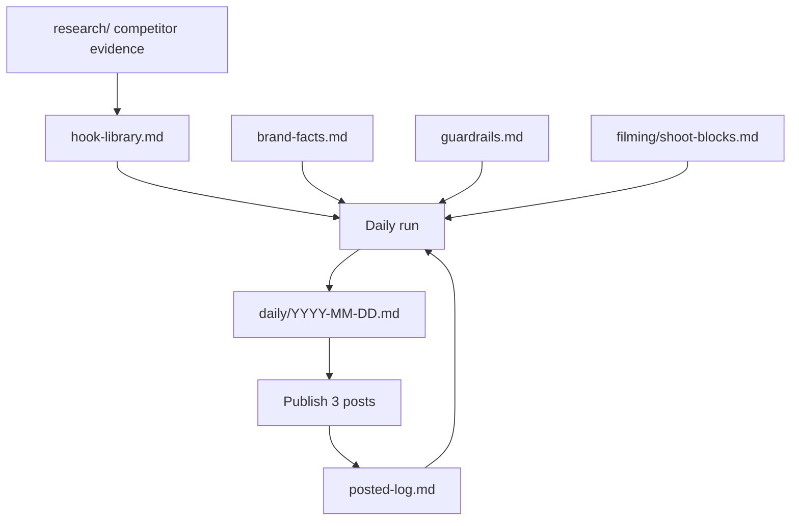

# UNIADS content engine

Three platform-native posts a day — TikTok, Instagram, Facebook — written one day
at a time against a locked fact sheet, with everything that needs a camera filmed
in advance.

Documentation only. No application code, so nothing here affects the live site.

---

## Start here

**If you are about to film:** [filming/README.md](filming/README.md), then
[filming/shoot-schedule.md](filming/shoot-schedule.md).

**If you are about to post right now:** [assets/README.md](assets/README.md) — the
files and the exact captions. Then log the result in
[posted-log.md](posted-log.md).

**If you are setting up the daily job:** [daily-run.md](daily-run.md).

**If you want to know what the competition is actually doing:**
[research/competitor-teardown.md](research/competitor-teardown.md).

## Files

| File | What it is |
| --- | --- |
| [brand-facts.md](brand-facts.md) | The only approved claim set. Every figure sourced. |
| [guardrails.md](guardrails.md) | Banned claims, CAP Code rules, 14-point pre-publish checklist |
| [daily-run.md](daily-run.md) | The daily procedure, platform briefs, and the scheduled prompt |
| [posted-log.md](posted-log.md) | What ran, what performed, hook cooldowns, footage remaining |
| [research/competitor-teardown.md](research/competitor-teardown.md) | Evidence-based teardown of both competitors and the wider niche |
| [research/hook-library.md](research/hook-library.md) | Hooks tiered by evidence strength, plus measured anti-patterns |
| [filming/README.md](filming/README.md) | Production standards — camera, audio, light, delivery |
| [filming/shoot-blocks.md](filming/shoot-blocks.md) | 13 blocks with full scripts, shot lists, on-screen text |
| [filming/shoot-schedule.md](filming/shoot-schedule.md) | Two sessions, running order, kit list |
| [filming/ugc-brief.md](filming/ugc-brief.md) | Student testimonials and the consent process |
| [daily/](daily/) | One file per day, three posts, with the checklist worked through |
| [assets/README.md](assets/README.md) | Post-ready graphics and video, with copy-paste captions |
| [assets/generate_assets.py](assets/generate_assets.py) | Regenerates every graphic and video from the fact sheet |
| [ads/tiktok-launch.md](ads/tiktok-launch.md) | Paid TikTok setup — campaign, targeting, Instant Form, tracking |

## How it fits together

The loop back from publishing into the log is the part that matters: each day's
generation sees what actually performed, so the mix shifts towards what works
instead of repeating a plan written in advance.

## Why one day at a time

You asked for high-quality daily posts rather than a month dumped up front, to
avoid invented claims. That shapes the whole design:

- **The fact sheet is closed.** Anything not in `brand-facts.md` or a GOV.UK page cited there cannot be used. UNIADS publishes no statistics, so no post can cite an enrolment count, approval rate or satisfaction score — this is recorded explicitly so the absence is a rule rather than an oversight.
- **Hooks are ranked by evidence, not by how good they sound.** Tier 1 means a competitor has sustained real ad spend on it for months.
- **One day of output per run**, against a log of what already ran. Small batches are checkable; ninety posts are not.
- **Filming is batched separately**, so no post is ever written to fit footage that doesn't exist, and no shoot ever happens under deadline pressure.

## Three things the research changed

1. **The January 2027 intake is on a new funding system.** The Lifelong Learning Entitlement applies to courses starting on or after 1 January 2027, applications opened September 2026, and neither competitor mentions it anywhere — not on their sites, not in any of the 19 ads captured. See [brand-facts.md](brand-facts.md) section 6b. This is the strongest angle available and it has a shelf life, so SB-13 films first.

2. **Accuracy is a viable position.** A competitor advertises "maintenance loans up to £16,000 per year" when the published maximum is £14,135. Being the one who quotes the real number is a differentiator competitors cannot copy without correcting themselves.

3. **Volume does not work in this niche.** One account has posted 438 videos and its recent post got 832 views; another posted 51 and averages 14x the likes per video. The only six-figure video in the sample ran 12 seconds and earned roughly 19 shares per comment. Hence the craft rules: 12–20 seconds, one idea, written for the person who forwards it.

## Before day 1

Two things to settle:

- **Handles are settled:** TikTok `@Uniadsuk`, Instagram `@Uniads.uk`, both live in `src/data/site.ts`. The old `@uasuk` account is retired — publish nothing to it.
- **Book session 1.** Days 1–3 are written and two of the nine posts need no footage, but the video slots depend on it.
